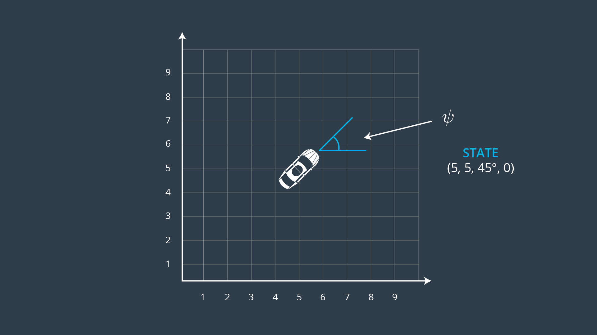
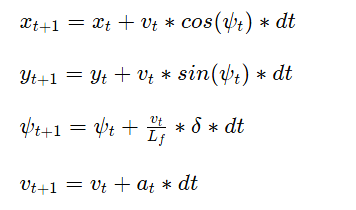
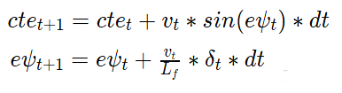

# CarND Controls MPC
### Udacity Self-Driving Car Engineer Nanodegree. Project: Model Predictive Control
This Project is the tenth task of the Udacity Self-Driving Car Nanodegree program. The main goal of the project is to implement in C++ Model Predictive Control to drive the car around the track. The program uses a simple Global Kinematic Model. Parameters were tuned in order to reach maximal speed.


**Result**: [YouTube video](https://www.youtube.com/watch?v=78nbaHPg-zg)

The project was created with the Udacity [Starter Code](https://github.com/udacity/CarND-MPC-Project) and [Simulator](https://github.com/udacity/self-driving-car-sim/releases) v1.4. 

---

## Model

A simple Kinematic model (ignores tire forces, gravity, mass, etc) was used for the Controller. Some attempts to build more complicated dynamic model were made, but with low success. It is essential to know parameters of the vehicle (such as law of response on the throttle, geometry of the car, drag model, tires properties, etc) to construct a reasonable dynamic model but such parameters are not derectly accessible from provided materials for the project. 

Position (_x,y_), heading (_ψ_) and velocity (_v_) form the vehicle state vector:

State: _[x,y,ψ,v]_



There are two actuators. Stearing angle (_δ_) is the first one, it should be in range [-25,25] deg. For simplicity the throttle and brake represented as a singular actuator (_a_), with negative values signifying braking and positive values signifying acceleration. It should be in range [-1,1].

Actuators: _[δ,a]_

The kinematic model can predict the state on the next time step by taking into account the current state and actuators as follows:



where Lf measures the distance between the front of the vehicle and its center of gravity. The parameter was provided by Udacity.

Errors: cross track error (_cte_) and _ψ_ error (_eψ_) were used to build the cost function for the MPC. They could be updated on a new time step using the following equationts:



## MPC

One of the most important tasks was to tune parameters of the cost function and other parameters for the Model Predictive Controller.

First of all, data about waypoints was transformed into the vehicle space and a 3d order polynomial was fitted to the data. Actual state of the vehicle was "shifted" into the future by 100 ms latency. It helps to reduce negative effects of the latency and increase stability of the controller. The latency was introduced to simulate real delay of a human driver or physical actuators in case of a self driving car. Cross track error and orientation error were calculated, is then they were passed into the MPC routine.

The time horizon (_T_) was chosen to 2 s after experiments. It was shown that the MPC could drive safely around the track with _T_ = 1 s, but on a slow speed. Higher speed requires more future information to make smart decisions in serial turns. Time step duration (_dt_) was setted equal to the latancy of the simulation (0.1 s), hense, 20 time steps (_N_) was used.

The cost function parameters were tuned by try-and-error method. All these parameters are stored in the `src/MPC.h` file. They were tuned in order to reach maximal speed and agressive race style with use of the whole width of the road and breaking before turns. 

## Hardware 

It was noticed that performance and quality of the controller strongly depend on computational power of your hardware. The MPC involves intense calculations during optimisation, that is why, weak PC can cause some problems due to extra latency. The project was developed and run on an AMD A8-5500 cpu with 16 GB of RAM. Simulator was setted to use 640x480 px resolution and the "Fastest" graphical quality preset.

## Dependencies

The project was build under environment provided by the Udacity [Docker container](https://hub.docker.com/r/udacity/carnd_mpc/). 

* cmake >= 3.5
 * All OSes: [click here for installation instructions](https://cmake.org/install/)
* make >= 4.1
  * Linux: make is installed by default on most Linux distros
  * Mac: [install Xcode command line tools to get make](https://developer.apple.com/xcode/features/)
  * Windows: [Click here for installation instructions](http://gnuwin32.sourceforge.net/packages/make.htm)
* gcc/g++ >= 5.4
  * Linux: gcc / g++ is installed by default on most Linux distros
  * Mac: same deal as make - [install Xcode command line tools]((https://developer.apple.com/xcode/features/)
  * Windows: recommend using [MinGW](http://www.mingw.org/)
* [uWebSockets](https://github.com/uWebSockets/uWebSockets)
  * Run either `install-mac.sh` or `install-ubuntu.sh`.
  * If you install from source, checkout to commit `e94b6e1`, i.e.
    ```
    git clone https://github.com/uWebSockets/uWebSockets 
    cd uWebSockets
    git checkout e94b6e1
    ```
    Some function signatures have changed in v0.14.x. See [this PR](https://github.com/udacity/CarND-MPC-Project/pull/3) for more details.
* Fortran Compiler
  * Mac: `brew install gcc` (might not be required)
  * Linux: `sudo apt-get install gfortran`. Additionall you have also have to install gcc and g++, `sudo apt-get install gcc g++`. Look in [this Dockerfile](https://github.com/udacity/CarND-MPC-Quizzes/blob/master/Dockerfile) for more info.
* [Ipopt](https://projects.coin-or.org/Ipopt)
  * Mac: `brew install ipopt`
  * Linux
    * You will need a version of Ipopt 3.12.1 or higher. The version available through `apt-get` is 3.11.x. If you can get that version to work great but if not there's a script `install_ipopt.sh` that will install Ipopt. You just need to download the source from the Ipopt [releases page](https://www.coin-or.org/download/source/Ipopt/) or the [Github releases](https://github.com/coin-or/Ipopt/releases) page.
    * Then call `install_ipopt.sh` with the source directory as the first argument, ex: `bash install_ipopt.sh Ipopt-3.12.1`. 
  * Windows: TODO. If you can use the Linux subsystem and follow the Linux instructions.
* [CppAD](https://www.coin-or.org/CppAD/)
  * Mac: `brew install cppad`
  * Linux `sudo apt-get install cppad` or equivalent.
  * Windows: TODO. If you can use the Linux subsystem and follow the Linux instructions.
* [Eigen](http://eigen.tuxfamily.org/index.php?title=Main_Page). This is already part of the repo so you shouldn't have to worry about it.
* Simulator. You can download these from the [releases tab](https://github.com/udacity/self-driving-car-sim/releases).
* Not a dependency but read the [DATA.md](./DATA.md) for a description of the data sent back from the simulator.


## Content of this repo

- `src/main.cpp` the main code for the project includes communication with the Simulator and data preprocessing
- `src/MPC.cpp` the MPC implementation
- `src/MPC.h` MPC parameters

## Basic Build Instructions


1. Clone this repo.
2. Make a build directory: `mkdir build && cd build`
3. Compile: `cmake .. && make`
4. Run it: `./mpc`.

## Tips

1. It's recommended to test the MPC on basic examples to see if your implementation behaves as desired. One possible example
is the vehicle starting offset of a straight line (reference). If the MPC implementation is correct, after some number of timesteps
(not too many) it should find and track the reference line.
2. The `lake_track_waypoints.csv` file has the waypoints of the lake track. You could use this to fit polynomials and points and see of how well your model tracks curve. NOTE: This file might be not completely in sync with the simulator so your solution should NOT depend on it.
3. For visualization this C++ [matplotlib wrapper](https://github.com/lava/matplotlib-cpp) could be helpful.

## Editor Settings

We've purposefully kept editor configuration files out of this repo in order to
keep it as simple and environment agnostic as possible. However, we recommend
using the following settings:

* indent using spaces
* set tab width to 2 spaces (keeps the matrices in source code aligned)

## Code Style

Please (do your best to) stick to [Google's C++ style guide](https://google.github.io/styleguide/cppguide.html).

## Project Instructions and Rubric

Note: regardless of the changes you make, your project must be buildable using
cmake and make!

More information is only accessible by people who are already enrolled in Term 2
of CarND. If you are enrolled, see [the project page](https://classroom.udacity.com/nanodegrees/nd013/parts/40f38239-66b6-46ec-ae68-03afd8a601c8/modules/f1820894-8322-4bb3-81aa-b26b3c6dcbaf/lessons/b1ff3be0-c904-438e-aad3-2b5379f0e0c3/concepts/1a2255a0-e23c-44cf-8d41-39b8a3c8264a)
for instructions and the project rubric.

## Hints!

* You don't have to follow this directory structure, but if you do, your work
  will span all of the .cpp files here. Keep an eye out for TODOs.

## Call for IDE Profiles Pull Requests

Help your fellow students!

We decided to create Makefiles with cmake to keep this project as platform
agnostic as possible. Similarly, we omitted IDE profiles in order to we ensure
that students don't feel pressured to use one IDE or another.

However! I'd love to help people get up and running with their IDEs of choice.
If you've created a profile for an IDE that you think other students would
appreciate, we'd love to have you add the requisite profile files and
instructions to ide_profiles/. For example if you wanted to add a VS Code
profile, you'd add:

* /ide_profiles/vscode/.vscode
* /ide_profiles/vscode/README.md

The README should explain what the profile does, how to take advantage of it,
and how to install it.

Frankly, I've never been involved in a project with multiple IDE profiles
before. I believe the best way to handle this would be to keep them out of the
repo root to avoid clutter. My expectation is that most profiles will include
instructions to copy files to a new location to get picked up by the IDE, but
that's just a guess.

One last note here: regardless of the IDE used, every submitted project must
still be compilable with cmake and make./
